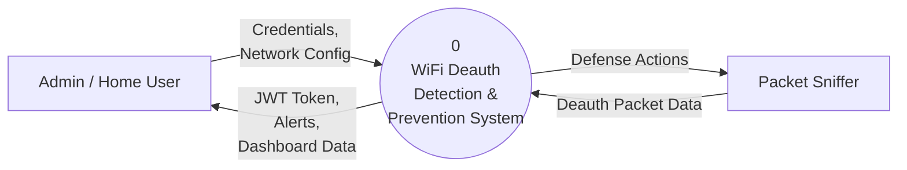
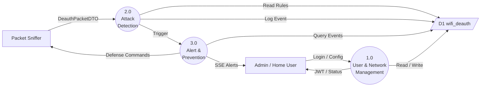
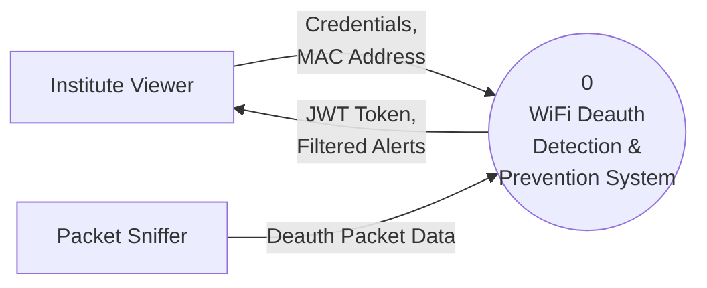
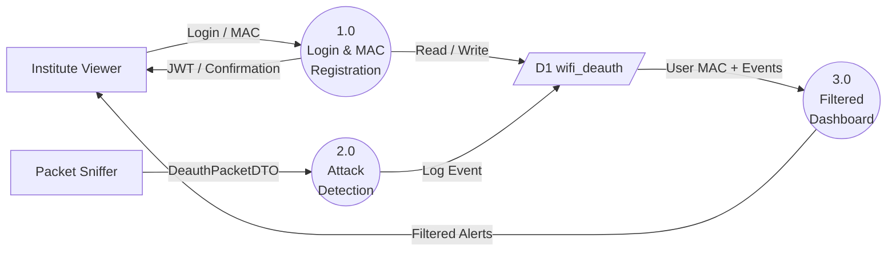
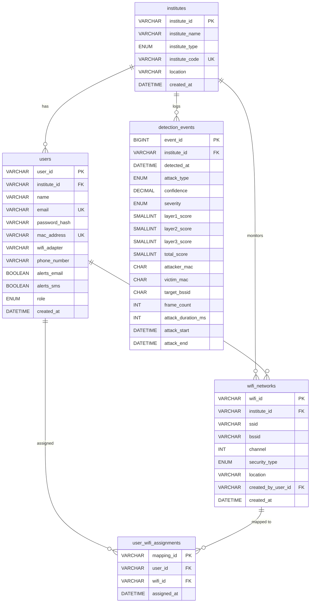

# WiFi Deauth Detection System — Actual Flow (as implemented)

```
┌──────────────────────────────────────────────────────────┐
│           PACKET CAPTURE (Monitor Mode)                  │
│              tshark / scapy / libpcap                    │
│           Interface: wlan1 (monitor mode)                │
└────────────────────┬─────────────────────────────────────┘
                     ↓
         ┌───────────────────────┐
         │  Is it deauth frame?  │
         └───────┬───────────────┘
                 ↓ YES
┌────────────────────────────────────────────────────────────┐
│ LAYER 1: FAST FILTER (parallel, 5ms timeout)              │
│                                                            │
│ ├─ RateAnalyzer       → 0/40/70/100 pts                   │
│ │   └─ Counts packets from same MAC in last 10s           │
│ │       ≤ 5  packets  → 0   (Normal)                      │
│ │       ≤ 10 packets  → 40  (Slightly Suspicious)         │
│ │       ≤ 25 packets  → 70  (Suspicious)                  │
│ │       > 25 packets  → 100 (Attack)                      │
│ │                                                          │
│ ├─ SequenceValidator  → score (0–100)                     │
│ │   └─ Checks for duplicate/out-of-order seq numbers      │
│ │                                                          │
│ ├─ TimeAnomalyDetector → score (0–100)                    │
│ │   └─ Detects burst timing anomalies                     │
│ │                                                          │
│ └─ SessionStateChecker → score (0–100)                    │
│     └─ Validates expected client state transitions        │
│                                                            │
│ COMBINED SCORE (weighted):                                 │
│   = Rate(35%) + Seq(25%) + Time(15%) + Session(20%)       │
│   Max = 95 pts                                             │
└────────────────────────┬───────────────────────────────────┘
                         ↓
              ┌──────────────────────┐
              │  Score ≥ 5?          │  ← lowered from 40 (diagram)
              │  AND frame = DEAUTH? │    to catch early bursts faster
              └────┬─────────────────┘
                   │ NO (score 0–4)          │ YES (score ≥ 5)
                   ↓                         ↓
              [BROADCAST               ┌─────────────────────────────────────┐
               MINOR EVENT             │ LAYER 2: ML ENSEMBLE                │
               (LOW severity)]         │                                      │
                                       │ ├─ Decision Tree   → Attack/Normal  │
                                       │ ├─ Random Forest   → Attack/Normal  │
                                       │ ├─ Logistic Reg    → Attack/Normal  │
                                       │ └─ XGBoost         → Attack/Normal  │
                                       │                                      │
                                       │ Majority vote → ML Confidence 0–100%│
                                       └──────────────┬──────────────────────┘
                                                      ↓
                                       ┌──────────────────────────────────────┐
                                       │ LAYER 3: PHYSICAL (always runs)      │
                                       │                                       │
                                       │ ├─ RSSI Sanity Check     → 0–30 pts  │
                                       │ │   missing signal → 20 pts          │
                                       │ │   -50 to -30 dBm → 30 pts (strong) │
                                       │ │   -70 to -50 dBm → 15 pts          │
                                       │ │   < -85 dBm → 0 pts (weak/normal)  │
                                       │ │                                     │
                                       │ ├─ Multi-Client Pattern  → 0–25 pts  │
                                       │ │   (tracks unique targets per MAC    │
                                       │ │    in a 10s rolling window)         │
                                       │ │                                     │
                                       │ ├─ Beacon/Broadcast Check → 0–15 pts │
                                       │ │                                     │
                                       │ └─ TSF Clock Skew Check  → (Python)  │
                                       │     (Drift anomaly tagged at sniffer)│
                                       │                                       │
                                       │ Physical Score: 0–70 pts             │
                                       └──────────────┬───────────────────────┘
                                                      ↓
                                       ┌────────────────────v──────────────────┐
                                       │ CALCULATE FINAL CONFIDENCE           │
                                       │                                       │
                                       │  normL1 = (L1score / 95)  × 100      │
                                       │  normL2 = ML score (0–100)           │
                                       │  normL3 = (L3score / 70)  × 100      │
                                       │                                       │
                                       │  finalScore = normL1×30%             │
                                       │             + normL2×50%             │
                                       │             + normL3×20%             │
                                       │                                       │
                                       │  safety floor:                        │
                                       │  finalScore = max(finalScore, L1)    │
                                       └──────────────┬───────────────────────┘
                                                      ↓
                                       ┌──────────────────────────────────────┐
                                       │ THREAT LEVEL (from finalScore)       │
                                       │                                       │
                                       │  ≥ 50  → CRITICAL                    │
                                       │  ≥ 30  → HIGH                        │
                                       │  ≥ 15  → MEDIUM                      │
                                       │  < 15  → LOW                         │
                                       └──────────────┬───────────────────────┘
                                                      ↓
                          ┌───────────────────────────────────────────────────┐
                          │ ATTACK TRIGGER DECISION                           │
                          │                                                   │
                          │  mlConfirmsAttack   = ML confidence > 60%        │
                          │                       ← lowered from 75% (diag)  │
                          │  layer1ConfirmsAtk  = finalScore >= 20           │
                          │                       ← lowered from 40% (diag)  │
                          │                                                   │
                          │  if (mlConfirmsAttack OR layer1ConfirmsAttack)   │
                          │      → triggerAttack()   [UNSAFE state]          │
                          │  else                                             │
                          │      → broadcastMinorEvent() [no state change]   │
                          └──────────────┬────────────────────────────────────┘
                                         ↓ UNSAFE triggered
                          ┌──────────────────────────────────────────────────┐
                          │ STATUS FLAGS                                      │
                          │                                                   │
                          │  underAttack = true                               │
                          │  lastAttackTime = now                             │
                          │                                                   │
                          │  Cooldown: 8 seconds after last attack packet     │
                          │  ← reduced from 30s so SAFE flips back quickly   │
                          │                                                   │
                          │  Periodic check: every 2 seconds                 │
                          └──────────────┬────────────────────────────────────┘
                                         ↓
                          ┌──────────────────────────────────────────────────┐
                          │ SSE BROADCAST TO FRONTEND                        │
                          │                                                   │
                          │  Alert fields:                                    │
                          │  ├─ severity  (CRITICAL / HIGH / MEDIUM / LOW)   │
                          │  ├─ attackerMac, targetBssid, targetMac          │
                          │  ├─ score (finalScore)                           │
                          │  ├─ mlConfidence, mlPrediction, modelAgreement   │
                          │  ├─ layer2Score, layer3Score, layer3Notes        │
                          │  └─ timestamp                                    │
                          │                                                   │
                          │  DB: DetectionEvent saved with all sub-scores    │
                          │  DB: updated after ML via updateWithMlScores()   │
                          └──────────────────────────────────────────────────┘
```

---

## Key Differences From Original Diagram

| Step | Original Diagram | Current Code | Reason Changed |
|------|-----------------|--------------|----------------|
| ML gate (L1 score) | **≥ 40** → run ML | **≥ 5** → run ML | Catch early burst packets before DB window fills |
| Layer 3 gate | Only if **ML conf > 75%** | **Always runs** | Provides richer physical data on every packet |
| ML confidence trigger | **> 75%** → attack | **> 60%** → attack | Avoids NORMAL misclassification on genuine attacks |
| L1 score attack trigger | **≥ 40** | **≥ 20** | Same reason — early burst detection |
| Attack cooldown | **30 seconds** | **8 seconds** | Status flips SAFE quickly after attack stops |
| RateAnalyzer window | **5 seconds** | **10 seconds** | Wider window catches packets across batch processing lag |
| RateAnalyzer thresholds | normal ≤ 10, attack > 50 | normal ≤ 5, **attack > 25** | More sensitive to moderate floods |

---

# Data Flow Diagrams (DFD) — DeMarco & Yourdon Notation

> **Symbols used:** Rectangle = External Entity  |  Circle = Process  |  Open-ended Rectangle = Data Store  |  Arrow = Data Flow

---

## 1. (Context Diagram)



---

## 2. Admin / Home User — Level 1



---

## 3. Institute Viewer — Level 0 (Context Diagram)



---

## 4. Institute Viewer — Level 1



---

# Entity-Relationship (ER) Diagram

> Database: **wifi_deauth** (MySQL)


