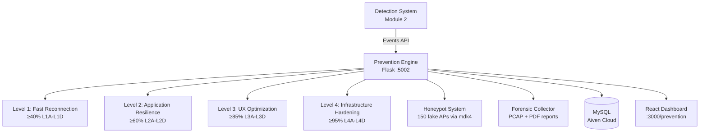

# Prevention Engine Architecture

## System Overview

The Prevention Engine is Module 3 of the WiFi Deauthentication Attack Prevention System. It monitors detection events and applies graduated defense strategies in real time.



## Defense Levels

| Level | Threshold | Components | Description |
|-------|-----------|------------|-------------|
| **L1** | ≥ 40% | 1A: OKC, 1B: Probe, 1C: Channel, 1D: Pre-Auth | Fast reconnection |
| **L2** | ≥ 60% | 2A: TCP, 2B: MPTCP, 2C: Buffers, 2D: Downloads | Application resilience |
| **L3** | ≥ 85% | 3A: Masking, 3B: Notification, 3C: Handoff, 3D: Degradation | UX optimization |
| **L4** | ≥ 95% | 4A: Cache, 4B: Dual-Radio, 4C: Mesh, 4D: SDN | Infrastructure hardening |

## File Structure

```
prevention-engine/
├── level1.py            # Main Flask engine (port 5002)
├── db.py                # Aiven MySQL connection & queries
├── config.yml           # Central configuration
├── schema.sql           # Database schema
├── requirements.txt     # Python dependencies
├── components.py        # Level 1 components (1A-1D)
├── level2_components.py # Level 2 components (2A-2D)
├── level3_components.py # Level 3 components (3A-3D)
├── level4_components.py # Level 4 components (4A-4D)
├── honeypot.py          # mdk4-based deception system
├── forensics.py         # PCAP capture + PDF report generation
├── network_topology.py  # Registered network discovery
├── logs/                # Runtime logs
└── tests/
    ├── test_levels.py    # Unit tests for 16 components
    ├── test_honeypot.py  # Honeypot generation tests
    └── mock_attack.py    # Manual event trigger
```

## Quick Start

```bash
# 1. Clean old files
make clean-prevention

# 2. Install dependencies
pip install -r prevention-engine/requirements.txt

# 3. Start the engine
make run-prevention

# 4. Run tests
make test-prevention

# 5. Test manually
python3 prevention-engine/tests/mock_attack.py 95
```

## API Endpoints

| Method | Endpoint | Description |
|--------|----------|-------------|
| GET | `/health` | Engine health check |
| GET | `/stats` | Dashboard KPIs |
| GET | `/prevention/events` | Recent events |
| DELETE | `/prevention/events` | Clear all events |
| POST | `/prevention/apply` | Manual trigger |
| POST | `/honeypot/start` | Activate honeypot |
| POST | `/honeypot/stop` | Deactivate honeypot |
| GET | `/honeypot/status` | Honeypot status |
| GET | `/forensics/reports` | List reports |
| GET | `/forensics/download/<file>` | Download report/PCAP |
| POST | `/forensics/generate/<id>` | Generate report |
