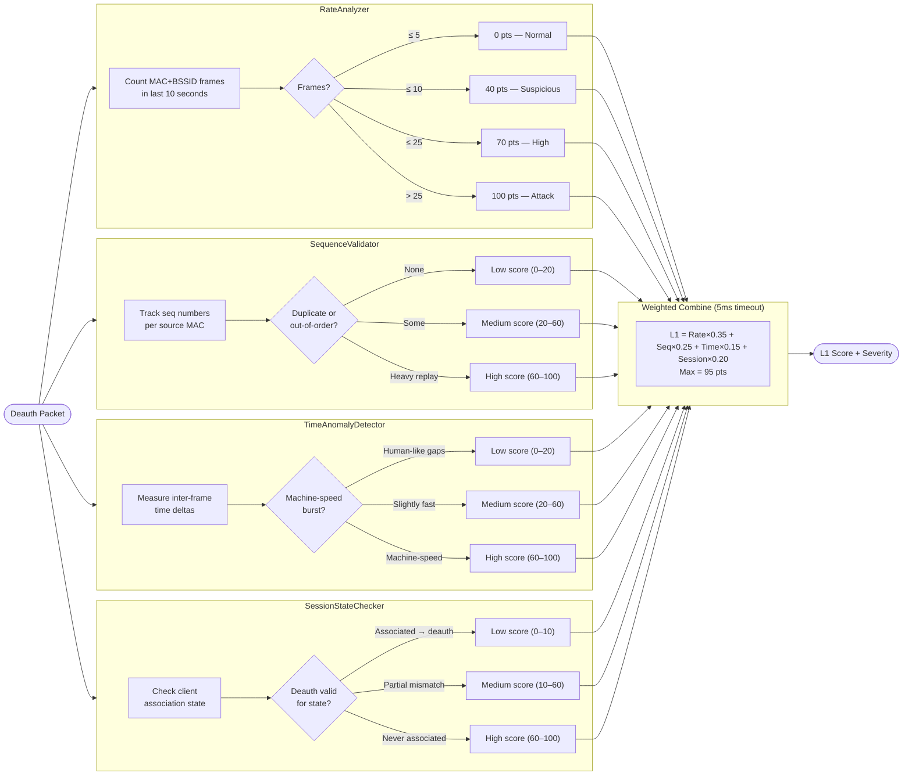
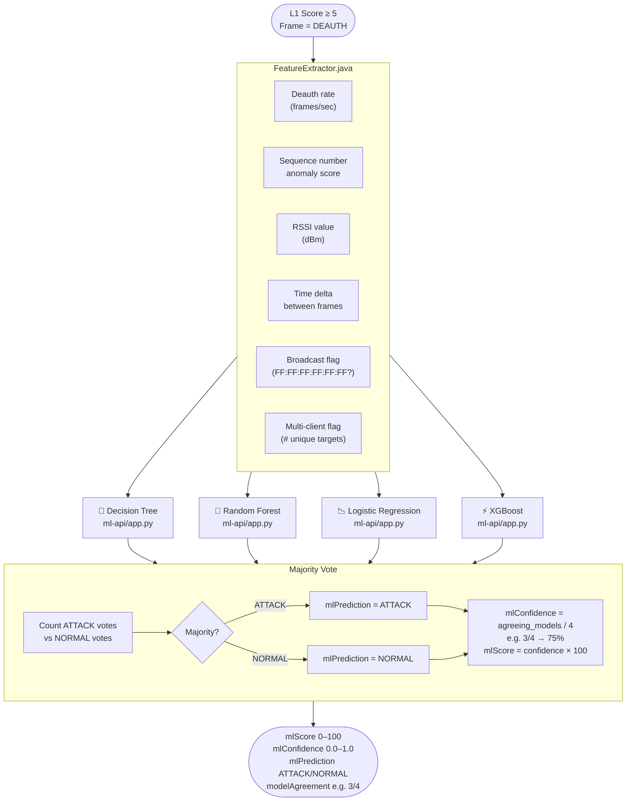
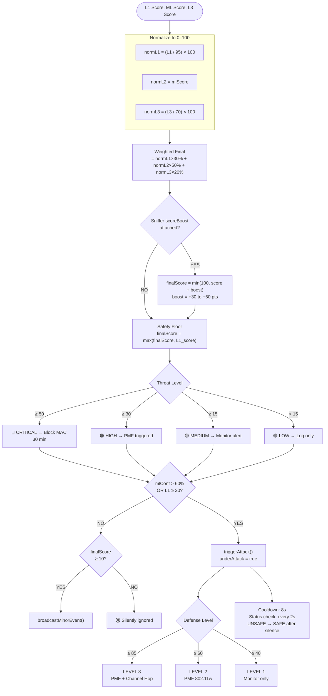

# WiFi Deauth Detection System — Mermaid Flowchart

> Paste any block below into [mermaid.live](https://mermaid.live) or any Mermaid-compatible renderer.

---

## Full Detection Pipeline (Top-Level)

```mermaid
flowchart TD
    A([📡 Packet Captured\nwlan1 — Monitor Mode\ntshark / scapy / libpcap]) --> B{Is frame type\nDEAUTH?}

    B -- ❌ NO --> Z1([🗑️ Discard Packet\nNot a deauth frame])
    B -- ✅ YES --> C

    %% ─── LAYER 1 ─────────────────────────────────────────
    subgraph L1["🔵 LAYER 1 — Fast Heuristics  ⏱ ≤5 ms  (max 95 pts)"]
        direction TB
        C([Enter Layer 1]) --> P1 & P2 & P3 & P4

        P1["🔢 RateAnalyzer\nCount deauths from same\nMAC+BSSID in last 10s\n──────────────────\n≤ 5  frames → 0 pts  (Normal)\n≤ 10 frames → 40 pts (Suspicious)\n≤ 25 frames → 70 pts (High)\n> 25 frames → 100 pts (Attack)"]

        P2["🔢 SequenceValidator\nDetect duplicate /\nout-of-order seq numbers\nfrom same MAC\n──────────────────\nScore: 0–100 pts"]

        P3["🔢 TimeAnomalyDetector\nDetect machine-speed\nburst timing anomalies\n──────────────────\nScore: 0–100 pts"]

        P4["🔢 SessionStateChecker\nValidate deauth matches\nexpected client state\n──────────────────\nScore: 0–100 pts"]

        P1 & P2 & P3 & P4 --> L1Score["📊 L1 Combined Score\n= Rate×35% + Seq×25%\n+ Time×15% + Session×20%\nMax = 95 pts"]

        L1Score --> L1Sev{"L1 Severity\n≥50 → CRITICAL\n≥30 → HIGH\n≥15 → MEDIUM\n< 15 → LOW"}
        L1Sev --> SaveDB1[("💾 Save to DB\nDetectionEvent\nwith L1 scores\n& severity")]
    end

    SaveDB1 --> Gate1{L1 Score ≥ 5\nAND frame = DEAUTH?}
    Gate1 -- ❌ NO\nScore 0–4 --> MinorEvent([📢 Broadcast Minor Event\nLOW severity\nNo state change])

    %% ─── LAYER 2 ─────────────────────────────────────────
    Gate1 -- ✅ YES --> L2Start

    subgraph L2["🟡 LAYER 2 — ML Ensemble  (score 0–100)"]
        direction TB
        L2Start([Enter Layer 2]) --> FE["🧬 FeatureExtractor.java\n──────────────────\n• Deauth rate (frames/sec)\n• Sequence number anomaly\n• RSSI value\n• Time delta between frames\n• Broadcast flag\n• Multi-client flag"]

        FE --> M1["🌳 Decision Tree\n→ Attack / Normal"]
        FE --> M2["🌲 Random Forest\n→ Attack / Normal"]
        FE --> M3["📉 Logistic Regression\n→ Attack / Normal"]
        FE --> M4["⚡ XGBoost\n→ Attack / Normal"]

        M1 & M2 & M3 & M4 --> Vote["🗳️ Majority Vote\nML Confidence = % models agree\ne.g. 3/4 → 75%\nmlScore: 0–100\nmlPrediction: ATTACK / NORMAL"]
    end

    Vote --> L3Start

    %% ─── LAYER 3 ─────────────────────────────────────────
    subgraph L3["🟠 LAYER 3 — Physical Checks  (max 70 pts)  Always runs"]
        direction TB
        L3Start([Enter Layer 3]) --> R1 & R2 & R3

        R1["📶 RSSI Sanity Check\n(max 30 pts)\n──────────────────\nMissing signal → 20 pts\n−50 to −30 dBm → 30 pts\n−70 to −50 dBm → 15 pts\n< −85 dBm  →  0 pts"]

        R2["👥 Multi-Client Pattern\n(max 25 pts)\n──────────────────\n1 unique target → 0 pts\n2 unique targets → 15 pts\n≥3 unique targets → 25 pts\n(10s rolling window)"]

        R3["📡 Broadcast Check\n(max 15 pts)\n──────────────────\nFF:FF:FF:FF:FF:FF → 15 pts\nUnicast → 0 pts"]

        R1 & R2 & R3 --> L3Score["📊 L3 Score\n= min(70, RSSI + Multi + Broadcast)\nMax = 70 pts"]
    end

    %% ─── FINAL SCORE ─────────────────────────────────────
    L3Score --> FinalCalc

    subgraph FINAL["🔴 Final Score Calculation"]
        direction TB
        FinalCalc(["⚙️ Normalize each layer\nnormL1 = (L1 / 95) × 100\nnormL2 = mlScore\nnormL3 = (L3 / 70) × 100"]) --> WeightedScore

        WeightedScore["📐 Weighted Score\nfinalScore = normL1×30%\n           + normL2×50%\n           + normL3×20%"] --> RssiBoost

        RssiBoost{"Sniffer detected\nMAC spoofing\n(scoreBoost)?"} -- ✅ YES --> Boost["➕ Add scoreBoost\n(+30 to +50 pts)\nfinalScore = min(100, final+boost)"]
        RssiBoost -- ❌ NO --> Floor

        Boost --> Floor["🛡️ Safety Floor\nfinalScore = max(finalScore, L1_score)\nPrevents ML from downgrading\nan obvious flood"]
    end

    Floor --> ThreatLevel

    %% ─── THREAT LEVEL ────────────────────────────────────
    subgraph THREAT["🎯 Threat Classification"]
        ThreatLevel{"Final Score\nThreshold"}
        ThreatLevel -- "≥ 50" --> TC["🔴 CRITICAL\nCRITICAL_ALERT\n→ Block MAC 30 min"]
        ThreatLevel -- "≥ 30" --> TH["🟠 HIGH\nBLOCK_ALERT\n→ PMF defense triggered"]
        ThreatLevel -- "≥ 15" --> TM["🟡 MEDIUM\nMONITOR_ALERT\n→ Logged, no block"]
        ThreatLevel -- "< 15" --> TL["🟢 LOW\n→ Feed only"]
    end

    TC & TH & TM & TL --> Decision

    %% ─── ATTACK DECISION ─────────────────────────────────
    subgraph ACT["⚡ Attack Trigger Decision"]
        Decision{" mlConfidence > 60%\nOR L1_score ≥ 20 ?"}
        Decision -- ✅ YES --> TriggerAttack
        Decision -- ❌ NO\nfinalScore ≥ 10 --> BroadcastMinor["📢 broadcastMinorEvent()\nNo state change\nLogged in feed"]
        Decision -- ❌ NO\nScore < 10 --> Silenced(["🔇 Silently Ignored"])

        TriggerAttack["⚠️ triggerAttack()\nunderAttack = true\nlastAttackTime = now"] --> DefLevel

        DefLevel{"Final Score\nDefense Level"}
        DefLevel -- "≥ 85" --> D3["🔴 LEVEL 3 — CRITICAL\nPMF + Channel Hop"]
        DefLevel -- "≥ 60" --> D2["🟠 LEVEL 2 — HIGH\nPMF (802.11w) enabled"]
        DefLevel -- "≥ 40" --> D1["🟡 LEVEL 1 — MEDIUM\nMonitor only"]
    end

    D3 & D2 & D1 & BroadcastMinor --> Broadcast

    %% ─── SSE + DB ────────────────────────────────────────
    subgraph OUTPUT["📤 Output & Persistence"]
        direction TB
        Broadcast["📡 SSE Broadcast to Frontend\n──────────────────────────\n• severity (CRITICAL/HIGH/MEDIUM/LOW)\n• attackerMac, targetBssid, targetMac\n• finalScore, mlConfidence\n• mlPrediction, modelAgreement\n• layer2Score, layer3Score\n• timestamp"] --> UpdateDB

        UpdateDB[("💾 Update DB Row\nupdateWithMlScores()\n──────────────────\nSame DetectionEvent row\nupdated with:\n• layer2Score, mlConfidence\n• mlPrediction, layer3Score\n• finalScore (totalScore)\n• severity re-evaluated")]
    end

    %% ─── COOLDOWN ────────────────────────────────────────
    UpdateDB --> Cooldown

    subgraph COOL["⏲️ Attack State Cooldown"]
        Cooldown["underAttack = true\nuntil (now − lastAttackTime) > 8s\nStatus check: every 2 seconds\nUNSAFE → SAFE after 8s of silence"]
    end

    %% ─── STYLES ──────────────────────────────────────────
    style L1 fill:#1a2a4a,stroke:#4a90d9,color:#e0f0ff
    style L2 fill:#2a2a1a,stroke:#d9c44a,color:#fffae0
    style L3 fill:#2a1a0a,stroke:#d97a4a,color:#fff0e0
    style FINAL fill:#2a0a0a,stroke:#d94a4a,color:#ffe0e0
    style THREAT fill:#1a0a2a,stroke:#9a4ad9,color:#f0e0ff
    style ACT fill:#0a1a0a,stroke:#4ad94a,color:#e0ffe0
    style OUTPUT fill:#0a1a2a,stroke:#4a9ad9,color:#e0f4ff
    style COOL fill:#1a1a1a,stroke:#999,color:#ccc
```

---

## Layer 1 — Parallel Analyzer Detail

---

## Layer 2 — ML Ensemble Detail

---

## Final Score + Defense Level Decision

---

## Quick Reference Thresholds

| Parameter | Value |
|---|---|
| Layer 1 timeout | **5 ms** |
| RateAnalyzer window | **10 seconds** |
| Rate: Normal | **≤ 5 frames** |
| Rate: Suspicious | **≤ 10 frames** |
| Rate: Attack | **> 25 frames** |
| ML gate (min L1 score) | **≥ 5** |
| ML trigger (attack) | **confidence > 60%** |
| L1 trigger (attack) | **L1 score ≥ 20** |
| Multi-client window | **10 seconds** |
| Attack cooldown | **8 seconds** |
| Status broadcast interval | **2 seconds** |
| Final score weights | **L1:30%, L2:50%, L3:20%** |
| CRITICAL threshold | **final ≥ 50** |
| HIGH threshold | **final ≥ 30** |
| MEDIUM threshold | **final ≥ 15** |
| Prevention block duration | **30 minutes** |
